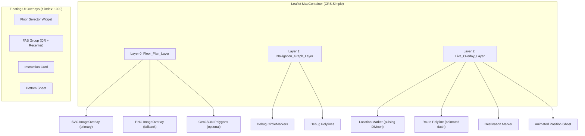
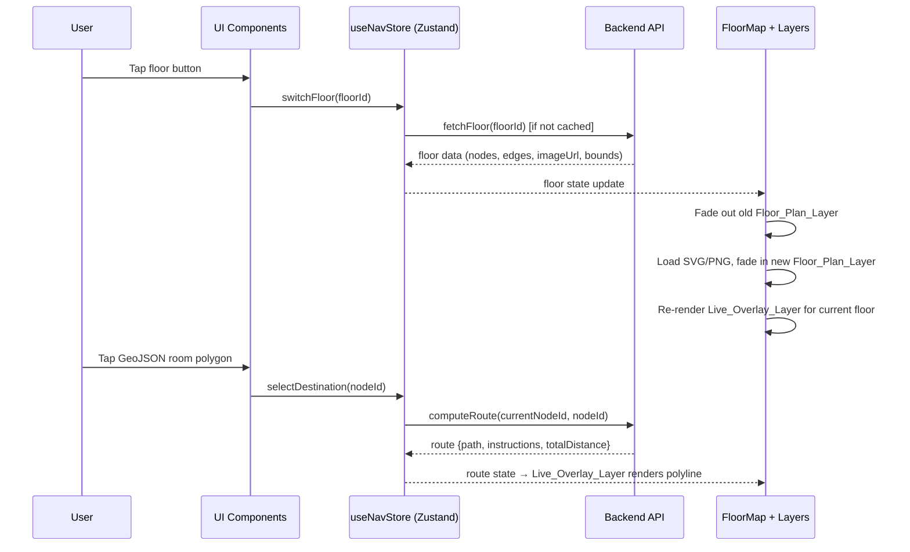

# Design Document: QR Nav UI Upgrade

## Overview

This design upgrades the QR Nav indoor navigation app's visual and component layer from a basic PNG-overlay approach to a professional three-layer map architecture with animated overlays, polished controls, and a consistent design token system. The upgrade is scoped exclusively to the frontend React/Vite application — the Python/FastAPI backend, navigation graph (nodes/edges), Dijkstra pathfinding, and all API contracts remain completely unchanged.

### Phase 1 Analysis Findings

| Aspect | Current State | Impact on Upgrade |
|--------|--------------|-------------------|
| **Map Engine** | Leaflet.js with `L.CRS.Simple` (pixel coordinates, Y-inverted: `[maxY - pixelY, pixelX]`) | SVG overlays fit directly to `[[0, 0], [maxY, maxX]]` bounds — no projection conversion needed |
| **Navigation Graph** | Nodes: `{id, x, y, label, type, floor_id, elevation}`. Edges: `{from_node, to_node, cost, reverse_cost, accessible, edge_type, floor_change, floor_delta}` | Schema untouched; visual layer reads coordinates only |
| **Pathfinding** | Backend `NavGraph.shortest_path()` (Dijkstra), cross-floor via floor_change edges. Frontend offline fallback via `buildOfflineRoute()` | No changes; route output consumed as `{path, instructions, totalDistance, floorTransitions}` |
| **Floor Switching** | `switchFloor(floorId)` in Zustand store, `FloorSelector` component with buttons | Extend with fade animation; keep same action interface |
| **Rendering Layers** | Single `ImageOverlay` (PNG) + `CircleMarker`/`Polyline` overlays in `FloorMap.jsx` | Separate into three conceptual layers; replace PNG with SVG where available |
| **State Management** | Zustand store (`useNavStore`) with state machine: `UNLOCATED → ANCHORED → ROUTE_PREVIEW → NAVIGATING → ARRIVED` | State machine unchanged; new components subscribe to existing selectors |

### Design Principles

1. **Visual-only upgrade** — No changes to data schemas, API contracts, or pathfinding logic
2. **Graceful degradation** — Each enhancement (SVG, GeoJSON, animations) falls back safely when optional data is missing
3. **Layer isolation** — Floor plan rendering, navigation graph, and live overlays are independent; changes to one don't cascade
4. **Mobile-first** — Touch targets ≥ 42px, `safe-area-inset` respect, `100dvh` layout

---

## Architecture

### Three-Layer Map Model



### Data Flow



---

## Components and Interfaces

### New Components

| Component | Location | Responsibility |
|-----------|----------|----------------|
| `FloorPlanLayer` | `src/components/FloorPlanLayer.jsx` | Renders SVG (primary) or PNG (fallback) as Leaflet ImageOverlay with fade transitions |
| `GeoJSONSpaces` | `src/components/GeoJSONSpaces.jsx` | Renders optional interactive room polygons with tooltips and click-to-navigate |
| `AnimatedRoutePolyline` | `src/components/AnimatedRoutePolyline.jsx` | Renders walked/remaining route segments with CSS dash animation and drop shadow |
| `PulsingLocationMarker` | `src/components/PulsingLocationMarker.jsx` | DivIcon-based pulsing blue dot with three-layer animation (pulse ring, outer circle, inner dot) |
| `InstructionCard` | `src/components/InstructionCard.jsx` | Floating top-of-map card showing current turn icon, instruction text, and distance |
| `BottomSheet` | `src/components/BottomSheet.jsx` | Bottom overlay with idle/navigation state crossfade, drag handle, map padding management |
| `FABGroup` | `src/components/FABGroup.jsx` | QR scan + re-center floating action buttons with conditional visibility |

### Modified Components

| Component | Changes |
|-----------|---------|
| `FloorMap.jsx` | Refactored to delegate rendering to sub-components; layer separation; SVG/PNG selection logic |
| `FloorSelector.jsx` | Add fade transition animation on floor switch; disable buttons during transition; updated styling per design tokens |
| `App.jsx` | Layout restructure for full-screen map with floating overlays; integrate new BottomSheet and InstructionCard |
| `index.css` | Extended with new design tokens (floor-plan palette, navigation colors, UI component tokens) |

### Component Interface Contracts

```typescript
// FloorPlanLayer props
interface FloorPlanLayerProps {
  svgUrl: string | null;      // from floor.map_svg_url
  pngUrl: string;             // from floor.imageUrl (always available)
  bounds: [[number, number], [number, number]]; // [[0,0], [maxY, maxX]]
  floorId: number;            // triggers fade transition on change
}

// GeoJSONSpaces props
interface GeoJSONSpacesProps {
  geojsonData: FeatureCollection | null;  // optional per-floor data
  onSelectDestination: (nodeId: number) => void;
}

// AnimatedRoutePolyline props
interface AnimatedRoutePolylineProps {
  walkedPositions: [number, number][];
  remainingPositions: [number, number][];
  previousRoutePositions: [number, number][];  // ghost during rerouting
  status: NavigationStatus;
}

// PulsingLocationMarker props
interface PulsingLocationMarkerProps {
  position: [number, number] | null;
  isUpdating: boolean;  // flash green on update completion
}

// InstructionCard props
interface InstructionCardProps {
  visible: boolean;
  turnType: string;
  primaryText: string;
  secondaryText: string;
  distance: string;
  onStepChange: number;  // key for animate-out/in trigger
}

// BottomSheet props
interface BottomSheetProps {
  status: NavigationStatus;
  locationName: string | null;
  destinationName: string | null;
  distanceLabel: string;
  stepInfo: string;
  onUpdateLocation: () => void;
  onExit: () => void;
  onReached: () => void;
  onLost: () => void;
}

// FABGroup props
interface FABGroupProps {
  showQR: boolean;
  showRecenter: boolean;
  onQRScan: () => void;
  onRecenter: () => void;
}
```

---

## Data Models

No backend data models are modified. The design consumes existing data shapes:

### Floor Data (from `/map/floor/{id}` API)

```json
{
  "floorId": 1,
  "floorName": "Ground Floor",
  "floorNum": 1,
  "imageUrl": "/maps/floor1.png",
  "map_svg_url": "/maps/floor1.svg",
  "bounds": { "minX": 0, "minY": 0, "maxX": 1000, "maxY": 800 },
  "nodes": [{ "id": 1, "x": 240, "y": 380, "label": "Main Lobby", "type": "entrance", "floor_id": 1 }],
  "pois": [{ "id": 1, "node_id": 9, "name": "Conference Room A", "category": "poi" }],
  "qrCodes": [{ "qr_code": "LOBBY-F1", "node_id": 1, "label": "Main Lobby" }]
}
```

### Optional GeoJSON Spaces (new frontend-only data)

```json
{
  "type": "FeatureCollection",
  "features": [
    {
      "type": "Feature",
      "properties": {
        "type": "room",
        "name": "Conference Room A",
        "nodeId": 9
      },
      "geometry": {
        "type": "Polygon",
        "coordinates": [[[250, 160], [350, 160], [350, 240], [250, 240], [250, 160]]]
      }
    }
  ]
}
```

GeoJSON files are optional per-floor enhancement data stored at `/assets/geojson/floor-{id}.json`. The `nodeId` property links polygons to existing navigation graph nodes.

### SVG Floor Plan Asset Convention

- Path: `/assets/floors/floor-{floorId}.svg`
- ViewBox: `0 0 {maxX} {maxY}` (matching floor bounds exactly)
- Coordinate system: Pixel coordinates matching the node graph (Y increases downward in SVG, same as node data)
- Leaflet renders at bounds `[[0, 0], [maxY, maxX]]` (Y inverted for CRS.Simple)

### Design Token Variables (new CSS custom properties)

```css
:root {
  /* Floor plan colors */
  --fp-wall: #2D2D2D;
  --fp-wall-inner: #555555;
  --fp-store: #E8E8E8;
  --fp-hallway: #F2F2F2;
  --fp-featured-store: #E2EDF5;

  /* Navigation overlay colors */
  --nav-route: #2196F3;
  --nav-route-walked: #6366f1;
  --nav-location: #1565C0;
  --nav-location-confirm: #4CAF50;
  --nav-destination: #ef4444;

  /* UI component colors */
  --ui-fab-qr: #00897B;
  --ui-fab-recenter: #1C1C1E;
  --ui-card-bg: #FFFFFF;
  --ui-card-shadow: 0 6px 20px rgba(0, 0, 0, 0.18);

  /* Radii */
  --radius-pill: 24px;
  --radius-card: 18px;
  --radius-fab: 50%;

  /* Transitions */
  --floor-fade-out: 250ms;
  --floor-fade-in: 300ms;
  --state-crossfade: 200ms;
  --location-fly-duration: 1.2s;
}
```

---

## Correctness Properties

*A property is a characteristic or behavior that should hold true across all valid executions of a system — essentially, a formal statement about what the system should do. Properties serve as the bridge between human-readable specifications and machine-verifiable correctness guarantees.*

### Property 1: Layer Graceful Degradation

*For any* floor data object, if the SVG URL (`map_svg_url`) is null or the GeoJSON data is unavailable, the Map_Container SHALL render without error using the PNG fallback and omitting the GeoJSON layer respectively.

**Validates: Requirements 2.2, 3.4**

### Property 2: GeoJSON Polygon Tap Invokes Navigation

*For any* GeoJSON feature with a `nodeId` property, simulating a click on that polygon SHALL invoke the `selectDestination` store action with that exact node ID.

**Validates: Requirements 3.2**

### Property 3: GeoJSON Tooltip Displays Room Name

*For any* GeoJSON feature with a `name` property, the rendered polygon SHALL display a permanent tooltip containing that name text.

**Validates: Requirements 3.3**

### Property 4: Route Polyline Segment Differentiation

*For any* active route where `currentStep > 0`, the Route_Polyline SHALL render two visually distinct segments: a walked portion with reduced opacity/dashed style and a remaining portion with full opacity/animated style.

**Validates: Requirements 4.2**

### Property 5: Floor Selector Rendering and Active Highlight

*For any* set of loaded floors with count > 1, the Floor_Selector_Widget SHALL render one button per floor, and the button corresponding to `currentFloorId` SHALL have the active visual state (distinct background and scale). For floor count ≤ 1, the widget SHALL not render.

**Validates: Requirements 6.1, 6.2**

### Property 6: Floor Selector Tap Triggers Switch

*For any* floor button in the Floor_Selector_Widget that is not the currently active floor, tapping it SHALL call the `switchFloor` store action with that floor's ID.

**Validates: Requirements 6.3**

### Property 7: QR FAB Conditional Visibility

*For any* application state where the QR scanner is open OR the navigation status is ARRIVED, the QR scan FAB SHALL not be rendered in the DOM.

**Validates: Requirements 7.5**

### Property 8: Re-Center FAB Conditional Visibility

*For any* application state where `currentNodeId` is null (user has no anchored location), the re-center FAB SHALL be hidden or disabled.

**Validates: Requirements 8.3**

### Property 9: Instruction Card Turn Icon Mapping

*For any* turn type value in the set {left, right, straight, u_turn, elevator, stairs, escalator, destination, start}, the Instruction_Card SHALL render the corresponding icon from the icon mapping without falling back to a default.

**Validates: Requirements 9.2**

### Property 10: Instruction Card Conditional Visibility

*For any* navigation status that is not NAVIGATING, the Instruction_Card SHALL be hidden (not rendered or has `pointer-events: none` and `opacity: 0`).

**Validates: Requirements 9.4**

### Property 11: Minimum Touch Target Size

*For any* interactive element (button, clickable polygon, FAB, floor selector button) added by this upgrade, the element's minimum rendered dimension (width and height) SHALL be at least 42px.

**Validates: Requirements 14.1**

---

## Error Handling

| Scenario | Handling Strategy |
|----------|------------------|
| SVG file fails to load (404/network) | `FloorPlanLayer` catches load error, falls back to PNG `imageUrl` silently; logs warning to console |
| GeoJSON file fails to load | `GeoJSONSpaces` renders nothing; no user-facing error; floor plan and navigation remain functional |
| Floor switch during animation | Disable floor selector buttons during transition (`switching` state); queue second switch attempt |
| `flyTo` called with null position | Guard: skip `flyTo` when `currentNode` is null; re-center FAB hidden in this state |
| Route polyline with empty path | Guard: render nothing when `route.path.length < 2`; existing logic already handles this |
| GeoJSON polygon with no `nodeId` | Render polygon with tooltip but no click handler; no navigation action |
| Instruction card with unknown turn type | Fall back to generic arrow icon ('➡️'); existing TURN_ICONS map provides fallback |
| Bottom sheet state mismatch | Bottom sheet content keyed to store `status`; impossible state transitions prevented by Zustand state machine |
| invalidateSize() during rapid resize | Debounce with 200ms timeout (existing pattern); prevent minZoom flicker |

---

## Testing Strategy

### Unit Tests (Example-Based)

- **Layer ordering**: Verify Map_Container renders Floor_Plan_Layer before Navigation_Graph_Layer before Live_Overlay_Layer
- **Debug mode**: Verify nodes/edges visible only with `?debug` URL param
- **SVG fallback**: Verify PNG renders when `map_svg_url` is null
- **Floor transition timing**: Verify fade-out is 250ms, fade-in is 300ms
- **Bottom sheet states**: Verify correct content renders for ANCHORED vs NAVIGATING
- **FAB interactions**: Verify QR FAB opens scanner, re-center FAB calls flyTo
- **Instruction card animation**: Verify step change triggers exit/enter animation classes
- **Location marker structure**: Verify three nested elements (pulse, outer, inner)

### Property-Based Tests

Property-based tests use `fast-check` (already available in the JS ecosystem via npm) with a minimum of 100 iterations per property. Each test is tagged with its design property reference.

| Property | Generator Strategy |
|----------|-------------------|
| P1: Graceful degradation | Generate floor objects with random combinations of null/present svg_url and geojson |
| P2: GeoJSON tap → selectDestination | Generate random FeatureCollections with varying nodeId values |
| P3: GeoJSON tooltip name | Generate random FeatureCollections with varying name strings |
| P4: Route segment differentiation | Generate random routes with varying path lengths and currentStep positions |
| P5: Floor selector rendering | Generate random floor sets with sizes 0–5 and random currentFloorId |
| P6: Floor selector tap | Generate random floor lists, pick non-active button, verify action call |
| P7: QR FAB visibility | Generate random state combinations of {scannerOpen, status} |
| P8: Re-center FAB visibility | Generate random states with null/non-null currentNodeId |
| P9: Icon mapping | Generate all turn types from the valid set, verify icon output |
| P10: Instruction card visibility | Generate random statuses from the state machine enum |
| P11: Touch targets | Generate all interactive element selectors, measure rendered dimensions |

### Integration Tests

- Full navigation flow: UNLOCATED → QR scan → ANCHORED → select destination → ROUTE_PREVIEW → begin → NAVIGATING → advance steps → ARRIVED → complete
- Floor switch during navigation: Verify polyline redraws for new floor segment
- Reroute flow: Verify previousRoute ghost renders during REROUTING, clears on resolution
- Offline fallback: Verify SVG/GeoJSON failures don't break navigation

### Test Configuration

```javascript
// Property test tag format
// Feature: qr-nav-ui-upgrade, Property {N}: {title}

import fc from 'fast-check';

// Example: Property 1
test('Feature: qr-nav-ui-upgrade, Property 1: Layer Graceful Degradation', () => {
  fc.assert(
    fc.property(
      fc.record({
        map_svg_url: fc.oneof(fc.constant(null), fc.webUrl()),
        imageUrl: fc.webUrl(),
        geojson: fc.oneof(fc.constant(null), fc.constant({ type: 'FeatureCollection', features: [] }))
      }),
      (floorData) => {
        // Render FloorPlanLayer with this data — should not throw
        // Assert: component renders without error
      }
    ),
    { numRuns: 100 }
  );
});
```
