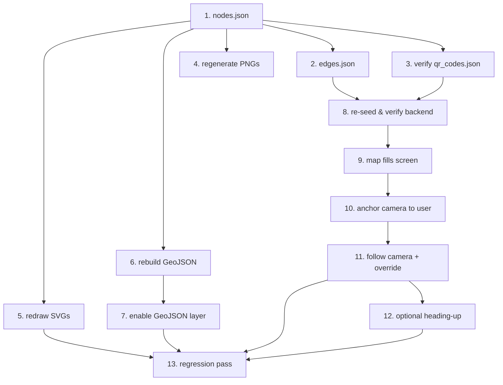

# Implementation Plan: Realistic Floor Plan & Google-Maps-Style Map View

## Overview

Scope is two coordinated changes:

- **Part A — Realistic building data.** Replace the abstract/misaligned building graph with
  a realistic, navigable two-floor enterprise office layout whose SVG, GeoJSON, nodes, and
  edges all share the exact same local-pixel coordinate space.
- **Part B — Google-Maps-style map view.** Rework the Leaflet viewport so the floor plan
  fills the device screen (portrait) and the camera anchors to / follows the user's location,
  instead of rendering a small zoomed-out horizontal box centered on the whole image.

Execute tasks strictly top-to-bottom. Each task is independently verifiable. Do not start a
task until the previous one is verified.

### Strict Constraints (DO NOT BREAK)

1. **Local Cartesian CRS, not geographic.** Coordinates are pixel offsets: `x` → right,
   `y` → down. GeoJSON coordinates are `[x, y]` pixel pairs, NOT WGS84 `[lng, lat]`. This
   intentionally violates RFC 7946; every new GeoJSON file MUST carry a `crs` property
   documenting the deviation.
2. **No database schema changes.** `models.py` stays untouched. `nodes.x` / `nodes.y` remain
   two `Float` columns. Only seed JSON *data* and static assets change.
3. **Preserve existing node IDs, types, and labels.** `qr_codes.json` references node IDs
   `1, 7, 8, 9, 12, 14` (Floor 1) and `101, 108, 109, 112, 113, 114` (Floor 2). These IDs,
   their `type`, and `label` MUST NOT change — only `x/y`. New junctions use `15–99` (Floor 1)
   and `115–199` (Floor 2).
4. **ID ranges by floor.** Floor 1 = `1–99`, Floor 2 = `101–199`.
5. **Leaflet transform stays.** `toLatLng(node, maxY) = [maxY - node.y, node.x]` is correct.
   `GeoJSONSpaces.jsx`'s `[x,y] → [y,x]` swap is correct. Do not change either.
6. **SVG viewBox must equal floor bounds.** Floor 1 = `viewBox="0 0 2000 1400"`, Floor 2 =
   `viewBox="0 0 1200 800"` (matches DB `bounds`).
7. **Edge costs are Euclidean pixel distance** `round(hypot(Δx, Δy))`. Connector edges keep
   small fixed costs and `floor_change: true`.
8. **Stacked-core alignment.** Elevator `8`/`108` and stairs `14`/`114` keep matching
   proportional positions across floors.
9. **Do NOT reintroduce the camera-coupling regression.** The `qr-nav-ui-regression-fixes`
   spec removed automatic `map.flyTo` on position change (it caused "map snaps back while
   panning"). The follow camera MUST be an explicit, user-overridable mode.
10. **Do NOT touch:** `models.py`, `graph.py`, `routes/routing.py`, `routes/scan.py`,
    `routes/map.py`, `routes/offline.py`, `db.py`, `seed.py`, `useNavStore.js` state machine,
    `api/index.js`, `AnimatedRoutePolyline.jsx`, `GeoJSONSpaces.jsx`, `FloorPlanLayer.jsx`
    (except the explicit exceptions named in tasks).

### Target Building Design

A two-floor enterprise office building using a double-loaded corridor grid. A central
vertical circulation core (stairs + elevator) sits mid-floor on each level, stacked between
floors. Rooms hang off perimeter corridors; junction nodes sit at every corridor intersection
so routes turn around corners cleanly instead of cutting through walls.

- **Floor 1 (Ground, 2000×1400):** south street entrance → reception → central core. North
  wing: Conference Room A, Office Suite 201. South wing: Restroom, Cafeteria. East spine: IT.
- **Floor 2 (Second, 1200×800):** west reception lobby. North wing: Meeting Rooms B1/B2.
  South wing: Break Room, Lounge. East wing: Executive Office. Core stacked over Floor 1.

## Tasks

- [x] 1. Replace `backend/seed/nodes.json` with the realistic layout
  - Replace the entire file. Preserve all existing IDs/types/labels; only coordinates change.
    Use schema fields exactly: `{ "id", "x", "y", "type", "label", "floor_id", "elevation" }`.
  - Floor 1 nodes (bounds 2000×1400, elevation 0): `1` entrance Main Lobby (1000,1250);
    `2` junction Lobby Junction (1000,950); `3` junction North Corridor West (600,450);
    `4` junction North Corridor East (1400,450); `5` junction South Corridor West (600,950);
    `6` junction South Corridor East (1400,950); `7` junction Center Junction (1000,700);
    `8` elevator Elevator Bank (1150,700); `9` poi Conference Room A (600,250);
    `10` poi Office Suite 201 (1000,250); `11` poi Restroom (600,1150);
    `12` poi Cafeteria (1400,1150); `13` poi IT Department (1700,700);
    `14` stairs Stairwell A (850,700); `15` junction West Spine Junction (600,700);
    `16` junction East Spine Junction (1400,700); `17` junction North Center Junction (1000,450).
  - Floor 2 nodes (bounds 1200×800, elevation 1): `101` entrance Floor 2 Lobby (120,400);
    `102` junction Floor 2 Junction (600,400); `103` junction North Hall West (380,220);
    `104` junction North Hall East (820,220); `105` junction South Hall West (380,580);
    `106` junction South Hall East (820,580); `107` junction East Wing Junction (900,400);
    `108` elevator Elevator Bank (690,400); `109` poi Meeting Room B1 (380,100);
    `110` poi Meeting Room B2 (820,100); `111` poi Break Room (380,700);
    `112` poi Lounge Area (820,700); `113` poi Executive Office (1080,400);
    `114` stairs Stairwell A (510,400); `115` junction West Hall Junction (380,400);
    `116` junction East Hall Junction (820,400).
  - _Verify:_ Floor 1 `x∈[0,2000]`,`y∈[0,1400]`; Floor 2 `x∈[0,1200]`,`y∈[0,800]`. Node `8`
    `(0.575,0.5)` matches `108`; node `14` `(0.425,0.5)` matches `114`. All QR-referenced IDs
    (`1,7,8,9,12,14,101,108,109,112,113,114`) still present with unchanged type/label.

- [x] 2. Replace `backend/seed/edges.json` with the realistic topology
  - Replace the entire file. Edge shape: `{ "from", "to", "cost", "edge_type" }`. Walkable
    edges use `"edge_type": "walkable"` and omit `floor_change`/`floor_delta` (loader defaults).
  - Floor 1 walkable edges (precomputed Euclidean costs): 15-14:250, 14-7:150, 7-8:150,
    8-16:250, 16-13:300, 3-17:400, 17-4:400, 5-2:400, 2-6:400, 9-3:200, 3-15:250, 15-5:250,
    5-11:200, 10-17:200, 17-7:250, 7-2:250, 2-1:300, 4-16:250, 16-6:250, 6-12:200.
  - Floor 2 walkable edges: 101-115:260, 115-114:130, 114-102:90, 102-108:90, 108-116:130,
    116-107:80, 107-113:180, 109-103:120, 103-115:180, 115-105:180, 105-111:120, 110-104:120,
    104-116:180, 116-106:180, 106-112:120.
  - Append cross-floor connectors (bidirectional, `floor_change: true`): `8↔108` elevator
    cost 30 (`floor_delta` +1/−1); `14↔114` stairs cost 45 (`floor_delta` +1/−1).
  - _Verify:_ trace connectivity — every node reachable; `1→12` stays on Floor 1; `1→112`
    crosses via elevator/stairs. No diagonal edges crossing room interiors.

- [x] 3. Verify (do not rewrite) `backend/seed/qr_codes.json`
  - Confirm every `node_id` still exists in the new `nodes.json` with the same `floor_id`
    (no edits expected since IDs are unchanged).
  - Optionally refresh stale label wording only; do not change `qr_code` strings or `node_id`.

- [x] 4. Regenerate PNG fallbacks in `backend/generate_floorplan.py`
  - Update Floor 1 room boxes (canvas 2000×1400) so each labeled room surrounds its POI node:
    Main Lobby [880,1150]–[1120,1320], Conference Room A [460,120]–[740,330], Office Suite 201
    [860,120]–[1140,330], Restroom [460,1040]–[740,1260], Cafeteria [1240,1040]–[1560,1260],
    IT Department [1580,580]–[1860,820], Elevator Bank [1100,640]–[1200,760], Stairwell A
    [790,640]–[910,760]. Draw corridor fill along the spine (y≈640–760) and verticals
    (x≈560–640, 960–1040, 1360–1440).
  - Update Floor 2 room boxes (canvas 1200×800): Floor 2 Lobby [60,330]–[200,470], Meeting Room
    B1 [250,40]–[510,180], Meeting Room B2 [690,40]–[950,180], Break Room [250,620]–[510,770],
    Lounge Area [690,620]–[950,770], Executive Office [960,300]–[1180,500], Elevator Bank
    [640,360]–[740,440], Stairwell A [460,360]–[560,440].
  - Keep canvas sizes exactly 2000×1400 and 1200×800 and the floor border helper.
  - _Verify:_ `python generate_floorplan.py` writes `seed/floor1.png` and `seed/floor2.png`
    without error and rooms sit where the nodes are.

- [x] 5. Redraw the SVG floor plans (primary visual; visual-only, no nav data)
  - Replace `frontend/public/assets/floors/floor-1.svg` keeping `viewBox="0 0 2000 1400"`:
    outer building shell `<path>`; corridor fill rects matching task 4; room `<rect>`s + `<text>`
    labels for all six rooms; reuse `<defs>` icon symbols as `<use>` at node `8 (1150,700)`,
    `14 (850,700)`, `1 (1000,1250)`.
  - Replace `floor-2.svg` keeping `viewBox="0 0 1200 800"` with Floor 2 rooms and connector
    icons at `108 (690,400)`, `114 (510,400)`, `101 (120,400)`.
  - Add a top comment in each SVG restating Constraint 1 (local pixel CRS, Y-down) and
    Constraint 6 (viewBox = bounds). No node IDs or routing data in the SVG.
  - _Verify:_ open each SVG in a browser; rooms, corridors, and icons correspond to node positions.

- [x] 6. Rebuild the GeoJSON room layers (aligned + documented CRS)
  - Replace `frontend/public/assets/geojson/floor-1.json` as a `FeatureCollection` with a `crs`
    block: `{ "type":"name", "properties": { "name":"LOCAL_PIXEL_CARTESIAN", "note":"DEVIATION
    FROM RFC 7946: coordinates are [x,y] pixel offsets within viewBox 0 0 2000 1400 (Y down),
    NOT WGS84 [lng,lat]. Never pass to geographic libraries." } }`.
  - Add one `room` polygon Feature per POI using the SVG room boxes from task 5, each with
    `properties: { "type":"room", "name":<label>, "nodeId":<id> }` — Floor 1: Conference Room
    A→9, Office Suite 201→10, Restroom→11, Cafeteria→12, IT Department→13. Floor 2
    (`floor-2.json`, its own `crs.note` with viewBox 0 0 1200 800): Meeting Room B1→109,
    Meeting Room B2→110, Break Room→111, Lounge Area→112, Executive Office→113.
  - Rings are `[[x,y],...]` closed (first point repeated). Do NOT swap to `[y,x]` here —
    `GeoJSONSpaces.jsx` swaps at render time.
  - _Verify:_ each polygon box encloses its node's `(x,y)` from task 1.

- [x] 7. Re-enable the GeoJSON layer in `FloorMap.jsx` (only Part-A logic change here)
  - Replace the `?geojson` feature-flag gate so the layer renders by default: change
    `const enableGeoJSON = ... .has('geojson');` to `const enableGeoJSON = true;` and remove
    the stale "polygon coordinates don't align" comment.
  - Leave the `<GeoJSONSpaces>` element, its props, and the fetch effect unchanged.
  - _Verify:_ room polygons render aligned over the SVG; tapping a room with a `nodeId` calls
    `selectDestination` when status allows.

- [x] 8. Re-seed and verify the backend
  - Run `docker-compose exec backend python seed.py` (or `python seed.py` from `backend/`).
  - `GET /health` → `nodes` = 33 (17 Floor 1 + 16 Floor 2), connectors present.
  - `GET /map/floor/1` → node `1` has `x=1000,y=1250`; node `8` has `x=1150,y=700`.
  - `GET /route?from_=1&to=12` → stays on Floor 1 with sensible turn instructions.
  - `GET /route?from_=1&to=112` → includes a floor transition; `floorTransitions` non-empty
    referencing elevator (`8→108`) or stairs (`14→114`). Restart backend so the graph reloads.

- [x] 9. Make the map container fill the screen (portrait)
  - In `frontend/src/App.css` / `index.css`, ensure `.floor-map-shell` fills the full dynamic
    viewport height (`100dvh` with `100vh` fallback) and full width, accounting for top/bottom
    UI bars, so the map is never letterboxed in a small box.
  - Ensure `MapContainer` keeps `height:100%; width:100%` and its parent chain has a defined
    height down to the viewport (no `height:auto` collapse).
  - Confirm `map.invalidateSize()` runs on first mount and on `resize`/`orientationchange`
    (extend the existing `InvalidateSizeOnStatusChange` or add a listener if missing).
  - _Verify on a phone-sized viewport:_ the floor plan fills the screen with no large empty
    margins; rotation re-fits without clipping.

- [x] 10. Anchor the initial camera to the user's location at street-level zoom
  - Keep the `minZoom` whole-floor fit computation (users can still zoom out), but change the
    initial *active* view: once a location exists (status leaves `UNLOCATED`, or on QR scan),
    center on the user node and zoom to a comfortable street-level zoom showing roughly the
    user's room + adjacent corridor. Add a `DEFAULT_FOLLOW_ZOOM` constant.
  - While still `UNLOCATED`, keep the existing fit-to-floor overview; only zoom-to-user once a
    location exists.
  - Preserve per-floor viewport persistence (`FloorViewportPersistence`): a returning user's
    saved pan/zoom still wins over the default anchor.
  - _Verify:_ scanning `QR_LOBBY_MAIN` snaps the camera to the lobby node zoomed in (not the
    whole-floor overview), centered on the pulsing marker.

- [x] 11. Implement an explicit, overridable follow camera
  - Add a `followMode` flag (view-layer state). Default ON during `NAVIGATING`/`REROUTING`,
    OFF otherwise.
  - While ON, keep the camera centered on `animatedPosition || currentPos` (same source as the
    marker, so camera and marker never diverge). Use a short eased `panTo`/`setView`, not a long
    `flyTo`, to avoid fighting rapid step updates.
  - User-pan override: on user `dragstart` / user-initiated `zoomstart`, set `followMode = OFF`
    immediately. Distinguish user gestures from programmatic moves with an `isProgrammaticMove`
    ref set around your own `panTo`/`setView` calls.
  - Reuse the existing `map:recenter` FAB (handled by `RecenterOnEvent`): it sets
    `followMode = ON` and re-anchors. Emphasize this FAB whenever `followMode` is OFF during
    navigation (Google-Maps "re-center" button).
  - Do NOT modify `useNavStore` semantics or add an unconditional position→camera effect.
    Camera logic stays in the view layer.
  - _Verify:_ during navigation the camera follows forward; dragging stops follow (no snap-back);
    tapping recenter resumes follow and re-anchors.

- [x] 12. (Optional, gated) Heading-up orientation
  - Only if a reliable heading source exists; otherwise leave north-up (Tasks 10–11 already
    address the "horizontal/zoomed-out" complaint).
  - If implementing: derive bearing from consecutive route nodes and rotate so travel direction
    points up. Leaflet core has no rotation — use a vetted plugin or rotate only the marker icon,
    NOT the tile/overlay layer (preserves hit-testing). Provide a toggle; default north-up if
    heading is unavailable/jittery.
  - _Verify:_ rotation does not misalign click targets, the route polyline, or GeoJSON polygons;
    if any misalignment, ship north-up only.

- [x] 13. Full regression pass
  - Run frontend tests (`FloorMap.test.jsx`, `App.test.jsx`) and backend tests in
    `backend/tests/`; fix only what this change touched.
  - Manually exercise flows the regression-fixes spec protects: pan during navigation (no
    snap-back), floor-switch fade, walked/remaining route split, reroute ghost, offline route
    fallback (`computeRoute` client path), QR scan anchoring.
  - `?debug` overlay shows all nodes on corridors/rooms and all edges along corridor lines (no
    diagonals through walls).
  - A cross-floor route (Main Lobby → Lounge Area) renders per floor, auto-switches floors at
    the connector, and the camera follows on both floors.

## Task Dependency Graph

```json
{
  "waves": [
    { "wave": 1, "tasks": ["1"], "dependsOn": [] },
    { "wave": 2, "tasks": ["2", "3", "4", "5", "6"], "dependsOn": ["1"] },
    { "wave": 3, "tasks": ["7", "8"], "dependsOn": ["2", "3", "6"] },
    { "wave": 4, "tasks": ["9"], "dependsOn": ["8"] },
    { "wave": 5, "tasks": ["10"], "dependsOn": ["9"] },
    { "wave": 6, "tasks": ["11"], "dependsOn": ["10"] },
    { "wave": 7, "tasks": ["12"], "dependsOn": ["11"] },
    { "wave": 8, "tasks": ["13"], "dependsOn": ["5", "7", "11", "12"] }
  ]
}
```



## Notes

- The original `nodes.json`/GeoJSON were authored against a small (~1000×700) canvas while the
  DB registers Floor 1 at 2000×1400 and Floor 2 at 1200×800 — that mismatch is the root cause of
  the disabled `?geojson` layer and the misplaced markers. This plan re-authors all coordinates
  in the true floor bounds so SVG, GeoJSON, nodes, and edges finally agree.
- No DB schema migration is required or permitted; only seed data and static assets change.
- Part B reconciles with the active `qr-nav-ui-regression-fixes` spec: follow-camera is an
  explicit, user-overridable mode so the "snap-back while panning" fix is preserved.
- The only logic edits to frontend components are: re-enabling the GeoJSON flag in
  `FloorMap.jsx` (task 7) and the view-layer camera work (tasks 9–12). State and routing logic
  are untouched.
```
---

- [x] 14. Fix floor dimension inconsistency — unify both floors to same coordinate system
  - **Problem:** Floor 1 uses 2000×1400 canvas, Floor 2 uses 1200×800. This causes different camera/viewport when switching floors, POIs of Floor 2 appearing out of place, different zoom/placement/scale between floors.
  - **Solution:** Remap Floor 2 to use the same 2000×1400 coordinate system as Floor 1, preserving relative layout proportions.
  - **Approach:** Scale Floor 2 coordinates proportionally: newX = oldX * (2000/1200), newY = oldY * (1400/800). For example:
    - Node 101 (Floor 2 Lobby): (120, 400) → (120×1.667, 400×1.75) = (200, 700)
    - Node 108 (Elevator): (690, 400) → (1150, 700) — aligns with Floor 1's elevator at (1150, 700)
    - Node 114 (Stairs): (510, 400) → (850, 700) — aligns with Floor 1's stairs at (850, 700)
  - **Actions:**
    a. Update `backend/seed/nodes.json` — remap all Floor 2 node coordinates to 2000×1400 scale while keeping relative positions
    b. Update `backend/seed/edges.json` — recalculate edge costs using Euclidean distance with new coordinates
    c. Update `backend/seed.py` — change Floor 2 bounds from `{"minX": 0, "minY": 0, "maxX": 1200, "maxY": 800}` to `{"minX": 0, "minY": 0, "maxX": 2000, "maxY": 1400}`
    d. Update `frontend/public/assets/floors/floor-2.svg` — change viewBox from `0 0 1200 800` to `0 0 2000 1400` and scale all elements proportionally
    e. Update `frontend/public/assets/geojson/floor-2.json` — remap all polygon coordinates to 2000×1400 scale, update the `crs` property note
  - **Verify:** Floor 2 elevator (node 108) at (1150, 700) aligns with Floor 1 elevator (node 8) at (1150, 700); Floor 2 stairs (node 114) at (850, 700) aligns with Floor 1 stairs (node 14) at (850, 700); switching floors no longer causes viewport/zoom jumps

- [x] 15. Fix floor bleeding — ensure POIs only render on their respective floor
  - **Problem:** When viewing Floor 1, Floor 2's POIs/rooms may appear overlayed, and vice versa. Each floor should only show its own elements.
  - **Solution:** Ensure proper floor filtering in all rendering layers.
  - **Actions:**
    a. Check `frontend/src/components/FloorMap.jsx` — verify that nodes, markers, and GeoJSON layers are filtered by `currentFloorId`
    b. Check `frontend/src/components/GeoJSONSpaces.jsx` — ensure the GeoJSON layer only renders features matching the active floor
    c. Check any POI rendering logic — verify POI markers are filtered by `floor_id` in the node data
    d. Verify that when switching floors, old floor elements are removed and new floor elements are added
  - **Verify:** Viewing Floor 1 shows only Floor 1 POIs (nodes 1-17); viewing Floor 2 shows only Floor 2 POIs (nodes 101-116); no cross-floor overlay when switching between floors

## Additional Task Dependency Graph Updates

```json
{
  "waves": [
    { "wave": 1, "tasks": ["1"], "dependsOn": [] },
    { "wave": 2, "tasks": ["2", "3", "4", "5", "6"], "dependsOn": ["1"] },
    { "wave": 3, "tasks": ["7", "8"], "dependsOn": ["2", "3", "6"] },
    { "wave": 4, "tasks": ["9"], "dependsOn": ["8"] },
    { "wave": 5, "tasks": ["10"], "dependsOn": ["9"] },
    { "wave": 6, "tasks": ["11"], "dependsOn": ["10"] },
    { "wave": 7, "tasks": ["12"], "dependsOn": ["11"] },
    { "wave": 8, "tasks": ["13"], "dependsOn": ["5", "7", "11", "12"] },
    { "wave": 9, "tasks": ["14"], "dependsOn": ["13"] },
    { "wave": 10, "tasks": ["15"], "dependsOn": ["14"] }
  ]
}
```